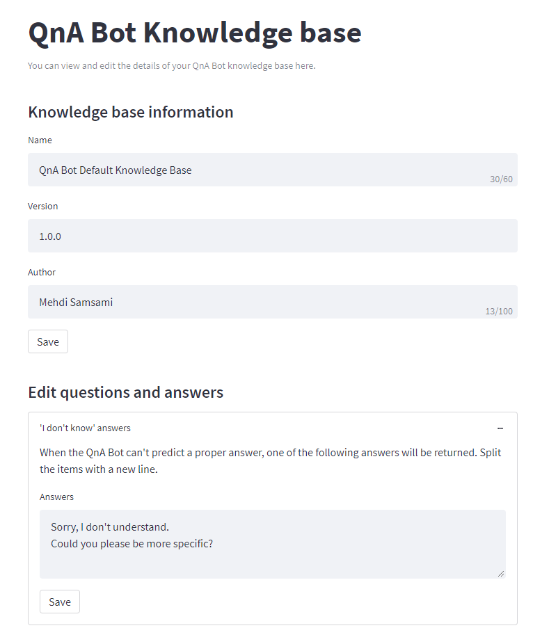

# QnA Bot

**QnA Bot** is a similarity-based conversational dialog engine for Python which makes it easy to generate automated responses to input text according to a set of known conversations, called the ***knowledge base***. QnA Bot relies on a collection of question-answer pairs to generate answers for new inputs. QnA Bot is can be set up and used in four simple steps:
1. Import the *QnABot* class:  `from qnabot import QnABot`
2. Initialize a bot using a knowledge base:  `bot = QnABot(kb_dir='knowledge_base.json')`
3. Fit the bot engine to the knowledge base:  `bot.fit()`
4. Generate answers:  `bot.answer('Hey. What's up?')`

Currently, QnA Bot engine supports the following algorithms for similarity-based answer generation:
- TF-IDF
- Murmurhash3

By calling `bot.knowledge_base()`, the knowledge base editor window will open up in your web browser and allows you to edit your knowledge base by adding, removing, or modifying questions/answers. Here you can see a screenshot of the knowledge base editor:

