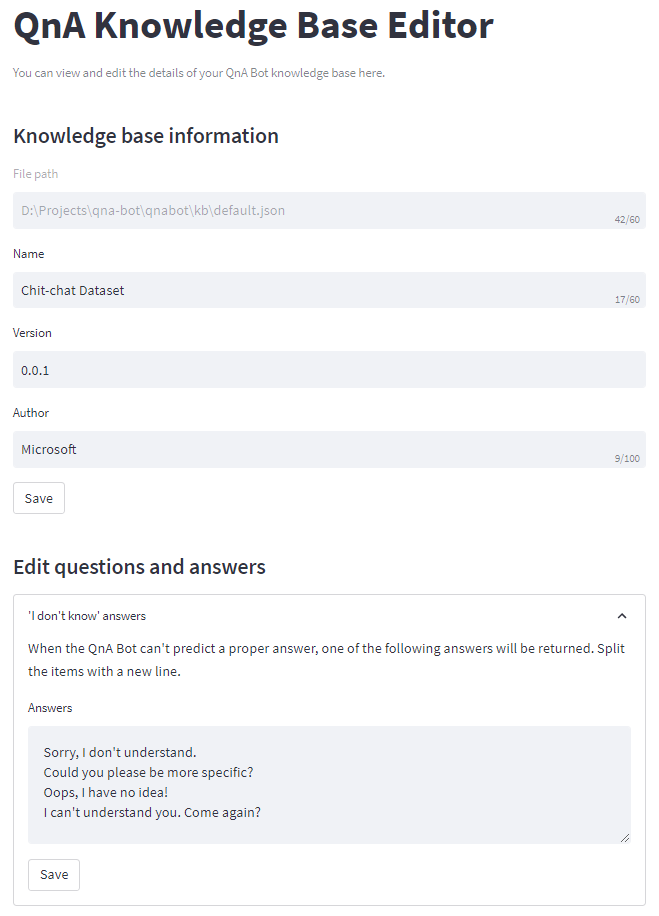

# QnA Builder


[](https://pypi.org/project/qna-builder/)


<p>

<br>
</p>

## Introduction

**QnA Builder** is a simple, no-code way to build chatbots in Python. It provides a similarity-based conversational dialog
engine, **QnA Bot**, which makes it easy to generate automated responses to input questions according to a set of known
conversations, i.e., question-answer pairs, stored in a ***knowledge base***. QnA Bot relies on a collection of
question-answer pairs to generate answers for new inputs.

## Install

The easiest way to install the qna-builder is by using `pip`:
```shell
pip install qna-builder
```
This library is shipped as an all-in-one module implementation with minimalistic dependencies and requirements.

## Getting started

A QnA Bot can be set up and used in four simple steps:

1. Import `QnABot` class

```python
from qnabuilder import QnABot
```

2. Initialize a bot
```python
bot = QnABot()
```

3. Fit the bot engine to a knowledge base
```python
bot.fit(kb="knowledge_base.json")
```

4. Generate answers
```python
bot.answer("Hey. What's up?")
```
`"All good. What's up with you?"`

## Algorithms

Currently, QnA Bot engine supports the following algorithms for similarity-based answer generation:
- TF-IDF Vectorization (`'tfidf'`)
- Murmurhash3 Vectorization (`'murmurhash'`)
- Count Vectorization (`'count'`)

Supported similarity metrics are as follows:
- Cosine similarity (`'cosine'`)
- Euclidean distance (`'euclidean'`)
- Manhattan distance (`'manhattan'`)
- Haversine distance (`'haversine'`)

## Knowledge base editor

By calling `run_editor()` method of `QnAKnowledgeBase` class, the knowledge base editor window will open up in
your web browser and allows you to edit your knowledge base by adding, removing, or modifying questions/answers.

```python
from qnabuilder import QnAKnowledgeBase

kb = QnAKnowledgeBase('my_knowledge_base.json')
kb.run_editor()
```

Here, you can see a screenshot of the knowledge base editor:

<div style="text-align:center">

</div>

Note that you need to install the optional requirement [streamlit](https://streamlit.io/) to be able to use the
knowledge base editor.